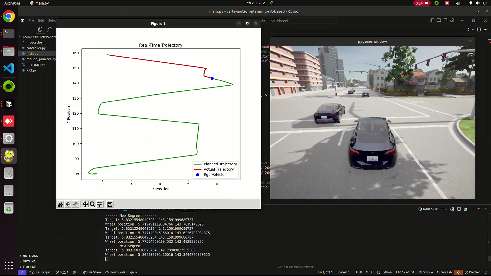
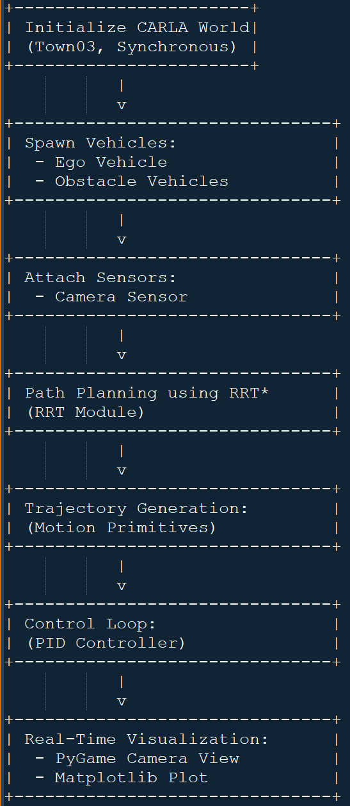

# CARLA Autonomous Driving Simulation with RRT-Based Path Planning and PID Control

## Overview

Autonomous driving simulation using the [CARLA Simulator](https://carla.org/)🤖 It implements a complete pipeline including:

- **Environment Setup:** Loading a CARLA world (e.g., Town03), configuring synchronous mode, and spawning vehicles (ego and obstacles).
- **Path Planning:** Generating collision-free paths using sampling-based algorithms (RRT, RRT*, and Informed RRT*) implemented in `RRT.py`.
- **Trajectory Generation:** Smoothing the planned path using motion primitives via cubic polynomial interpolation in `motion_primitive.py`.
- **Vehicle Control:** Controlling the ego vehicle using a combination of PID controllers for longitudinal (throttle/brake) and lateral (steering) actions, implemented in `controller.py`.
- **Real-Time Visualization:** Displaying a camera view using PyGame and a live-updating trajectory plot using Matplotlib.

[](https://youtu.be/Fb8x0_ZA6Ws)


## File Structure

- **main.py:**  
  Main source code that sets up the simulation, spawns vehicles, attaches sensors, executes path planning, generates trajectories, runs the control loop, and displays real-time visualizations.
  
- **RRT.py:**  
  Contains the implementation of RRT, RRT*, and Informed RRT* algorithms for path planning.

- **motion_primitive.py:**  
  Implements motion primitive generation using cubic polynomial interpolation for smooth trajectory creation.

- **controller.py:**  
  Implements PID controllers for both longitudinal (speed) and lateral (steering) vehicle control.

  

## Requirements

- **CARLA Simulator:**  
  Download and install CARLA from [here](https://carla.org/). Ensure the CARLA server is running before executing the project.

## Installation

1. **Clone the Repository:**

   ```bash
   git clone https://github.com/taherfattahi/carla-motion-planning-rrt-based
   cd carla-motion-planning-rrt-based
   ```

2. **Install the Required Python Packages:**

   ```bash
   pip install numpy matplotlib pygame scipy
   ```

## Usage
1. **Start the CARLA Server:**

Run the CARLA simulator (e.g., execute ```./CarlaUE4.sh``` on Linux or run the executable on Windows).

2. **Run the Main Script:**

```bash
python main.py
```

## Contributing
Contributions are welcome. If you find a bug or have a feature request, please open an issue or submit a pull request.

## Resources

- [CARLA Open-source simulator for autonomous driving research.](https://carla.org/)
- [Robotic Path Planning:](https://theclassytim.medium.com/robotic-path-planning-rrt-and-rrt-212319121378) RRT and RRT*
- [The PID Controller](https://www.ni.com/en/shop/labview/pid-theory-explained.html?srsltid=AfmBOoqwfVrbsvPLIhQCKk-5qvOw1RC8R9U0gvDvdn9WU0v0XgxdYGKf) & Theory Explained
